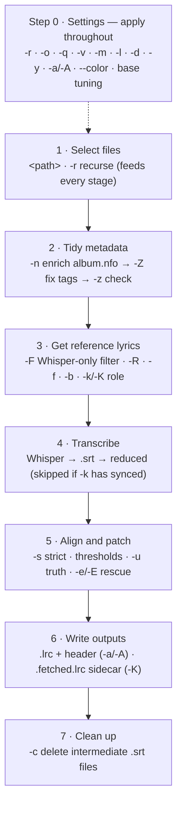

# PyLy — Lyrics for Plex, the offline way

PyLy listens to your music and writes the lyrics file for it — no account needed, no internet required by default.

It runs your audio through [Whisper](https://github.com/openai/whisper) (an offline speech-to-text model), cleans up the result, and saves a `.lrc` file next to your audio. Plex picks that file up automatically and shows lyrics in sync as the song plays.

> **Your audio files are never touched.** PyLy only ever reads them — with one opt-in exception: `--match-file-metadata` (`-Z`) deliberately rewrites tags to fix them, and defaults to making a backup first. See [Checking and fixing file tags](#checking-and-fixing-file-tags).

---

## Table of Contents

* [Before you start](#before-you-start)
* [Install](#install)
* [Quick start](#quick-start)
* [What PyLy creates](#what-pyly-creates)
* [Getting better results](#getting-better-results)
  * [Fetching lyrics from the internet](#fetching-lyrics-from-the-internet)
  * [Providing your own lyrics file](#providing-your-own-lyrics-file)
  * [Choosing a Whisper model](#choosing-a-whisper-model)
* [Lyric providers](#lyric-providers)
* [Re-downloading lyrics](#re-downloading-lyrics)
* [Checking and fixing file tags](#checking-and-fixing-file-tags)
* [Filling in album.nfo details from MusicBrainz](#filling-in-albumnfo-details-from-musicbrainz)
* [Advanced: fine-tuning the lyrics alignment](#advanced-fine-tuning-the-lyrics-alignment)
* [Advanced: fetch templates and folder layout hints](#advanced-fetch-templates-and-folder-layout-hints)
* [Advanced: what goes inside a .lrc file](#advanced-what-goes-inside-a-lrc-file)
* [ffmpeg](#ffmpeg)
* [How a run is ordered](#how-a-run-is-ordered)
* [All flags](#all-flags)

---

## Before you start

You'll need a few things installed:

- **Python 3.10 or newer** — [python.org](https://www.python.org/downloads/)
- **Whisper** — the speech-to-text model that does the heavy lifting
  ```
  pip install whisper
  ```
- **ffmpeg** — used internally to read audio. If you don't have it, see [ffmpeg](#ffmpeg) below.

**Optional but recommended:**

- **A CUDA-capable GPU** — Whisper is noticeably faster on a GPU. If you have an Nvidia card:
  ```
  pip install --upgrade torch torchvision torchaudio --index-url https://download.pytorch.org/whl/cu121
  ```
  Then pass `--device cuda` when running PyLy.

- **ffprobe** — part of the ffmpeg package on most systems. Used to read track metadata (artist, album, etc.) and measure the length of your audio. Not required, but things work better with it.

---

## Install

From the project folder:

```
pip install -e .
```

Or on Windows, just use `pyly.bat` — it will install PyLy automatically the first time and run your command:

```
pyly.bat "X:\Music\Queen\A Night at the Opera\11 Bohemian Rhapsody.flac"
```

Or on Linux systems, just use `pyly.sh` — it will install PyLy automatically the first time and run your command:

```
# Make the file executable (once)
sudo chmod +x pyly.sh
# Run the program as intended
pyly.sh "X:\Music\Queen\A Night at the Opera\11 Bohemian Rhapsody.flac"
```

---

## Quick start

**One song:**

```
pyly "X:\Music\Queen\A Night at the Opera\11 Bohemian Rhapsody.flac"
```

PyLy will listen to the file, figure out the words, and save `11 Bohemian Rhapsody.lrc` in the same folder. That's it.

**A whole album:**

```
pyly "X:\Music\Queen\A Night at the Opera"
```

**Your entire music library:**

```
pyly "X:\Music" --recursive
```

**Already have `.lrc` files and want to regenerate them?**

By default PyLy won't touch existing files. Add `--overwrite` to replace them:

```
pyly "X:\Music" --recursive --overwrite
```

**Want to keep things tidy?** Add `--clean` to delete the intermediate files PyLy creates along the way (they're only useful for debugging):

```
pyly "X:\Music\Queen\A Night at the Opera\11 Bohemian Rhapsody.flac" --clean
```

---

## What PyLy creates

When you run PyLy on `11 Bohemian Rhapsody.flac`, you'll find these new files in the same folder:

| File | What it is |
|---|---|
| `11 Bohemian Rhapsody.srt` | Raw transcript from Whisper |
| `11 Bohemian Rhapsody.red.srt` | Same transcript, with noise and junk lines removed |
| `11 Bohemian Rhapsody.lrc` | The final lyrics file — this is what Plex reads |
| `11 Bohemian Rhapsody.pyly.log` | A log of what happened, only created if you pass `--log` |

The `.srt` files are just intermediate steps. The only file you actually need is the `.lrc`. You can delete the others, or have PyLy do it for you with `--clean`.

**Supported audio formats:** `.mp3` `.flac` `.wav` `.m4a` `.aac` `.ogg` `.opus` `.alac` `.wma` `.aiff`

---

## Getting better results

Whisper is impressive, but it isn't perfect — especially on songs with heavy production, fast delivery, or unusual pronunciation. Here are the main ways to improve what you get out of PyLy.

### Fetching lyrics from the internet

The quickest way to get accurate lyrics is to let PyLy look them up online and use them as a reference. It still uses Whisper for the timing, but it replaces Whisper's guessed words with the correct ones wherever they match closely enough.

```
pyly "X:\Music\Queen\A Night at the Opera\11 Bohemian Rhapsody.flac" --fetch
```

If you'd rather skip Whisper entirely and just use the online lyrics as-is (synced timestamps and all, if available), use `--keep-as-primary`:

```
pyly "X:\Music\Queen\A Night at the Opera\11 Bohemian Rhapsody.flac" --keep-as-primary
```

Or if you want both — the online synced lyrics saved as a separate file, and PyLy's Whisper version as the main one:

```
pyly "X:\Music\Queen\A Night at the Opera\11 Bohemian Rhapsody.flac" --keep-as-alternate
```

This saves the fetched version as `11 Bohemian Rhapsody.fetched.lrc` and the Whisper version as the normal `11 Bohemian Rhapsody.lrc`.

Results are saved locally so PyLy won't re-fetch the same song twice.

### Providing your own lyrics file

If you already have the correct lyrics for a song as a plain text file (just the words, no timestamps), you can hand them to PyLy directly:

```
pyly "X:\Music\Queen\A Night at the Opera\11 Bohemian Rhapsody.flac" --base "lyrics.txt"
```

PyLy will use Whisper's timing but replace the guessed words with yours wherever they match. If Whisper is mostly right but has a few wrong words here and there, this cleans those up nicely.

If you have a lyrics file for every track and they're named the same as the audio file, you can use a wildcard:

```
pyly "X:\Music\Queen\A Night at the Opera" --base "*.txt"
```

For each `.flac` (or `.mp3`, etc.) it finds, PyLy will look for a matching `.txt` with the same name in the same folder.

**If you really trust your lyrics file** and want PyLy to fix even the sections where Whisper has gone completely off the rails, add `--truth`:

```
pyly "X:\Music\Queen\A Night at the Opera\11 Bohemian Rhapsody.flac" --base "lyrics.txt" --truth
```

This is more aggressive — it replaces garbled Whisper sections with your lyrics rather than just cleaning up close matches. It only kicks in when PyLy is confident the overall transcript is aligned to the right song, so it won't silently corrupt things if the wrong lyrics file is used.

### Choosing a Whisper model

Whisper comes in several sizes. Bigger models are slower but more accurate:

| Model | Speed | Accuracy |
|---|---|---|
| `tiny` | Very fast | Lower |
| `base` | Fast | Decent |
| `small` | Moderate *(default)* | Good |
| `medium` | Slow | Better |
| `large` | Slowest | Best |

```
pyly "X:\Music" --recursive --model large
```

If you have a GPU, `medium` or `large` are worth trying. On CPU, `small` is usually the best balance.

---

## Lyric providers

When you use `--fetch`, PyLy pulls lyrics from an online source. You can pick which one:

```
pyly "X:\Music\Queen\A Night at the Opera\11 Bohemian Rhapsody.flac" --fetch lrclib
pyly "X:\Music\Queen\A Night at the Opera\11 Bohemian Rhapsody.flac" --fetch musicbrainz
```

| Provider | What it does |
|---|---|
| `lrclib` *(default)* | A free, open database of synced lyrics. Fast and simple. |
| `musicbrainz` | Uses MusicBrainz to look up the canonical recording first, then fetches from lrclib using that cleaner metadata. Slower (about 2–3 seconds per track on the first pass), but more accurate for messy or unusual filenames. |

**When to use `musicbrainz`:** If lrclib keeps returning wrong results — for example, a live version instead of the studio track, or a cover instead of the original — MusicBrainz's extra lookup step often gets it right. It also records a MusicBrainz ID inside the `.lrc` file, which is useful if you use other MusicBrainz-aware tools.

Note that `musicbrainz` doesn't host lyrics itself. It just helps find the right entry in lrclib.

To see all available providers:

```
pyly --list-providers
pyly -p
```

---

## Re-downloading lyrics

When PyLy fetches lyrics online, it saves the source URL inside the `.lrc` file. Later, if the lyrics database has been updated or corrected, you can refresh your files without re-running Whisper:

```
# See what would be updated (nothing is written yet)
pyly "X:\Music" --recursive --redownload

# Actually update the files
pyly "X:\Music" --recursive --redownload --overwrite
```

You can point this at a single `.lrc` file, a single audio file (PyLy will find the matching `.lrc`), or a whole folder. Without `--overwrite`, it's a dry run — PyLy checks whether new lyrics are available but doesn't save anything, which is useful for testing before committing to a bulk update.

---

## Checking and fixing file tags

Sometimes a track's embedded tags are simply wrong — a ripper or a careless edit leaves `03 I'm in Love with My Car.flac` carrying the title *"You're My Best Friend"* (another track from the same album). Lyrics only line up when the tags are right, so PyLy can audit them and, if you ask, fix them.

**Check (read-only):**

```
pyly "X:\Music\Queen\A Night at the Opera" --check-file-metadata
```

For each file, PyLy compares the embedded **title, artist, album, year, and track** against what the file *should* contain and prints any mismatches. Nothing is written. PyLy works out the "correct" value in this order:

1. **`.nfo` files** — if a Kodi/Lidarr-style `album.nfo` sits next to the files (or one folder up), its album title, artist, year, and per-track titles win. An `artist.nfo` in the artist folder (the one above the albums, where Lidarr writes it) supplies the artist name and each album's year, which is handy when an `album.nfo` is missing or doesn't list an artist.
2. **Folder layout** — otherwise the artist/album/track come from the folder structure. Use `--layout lidarr|plex|flat` or a custom template to tell PyLy how your folders are arranged (same hint as `--fetch`). When a `.nfo` is present, its own location is used to work out the structure, so this usually just works without a `--layout` flag.
3. **Filename** — the track title falls back to the filename when the layout is `flat` or doesn't carry enough information.

PyLy reads `.nfo` files leniently: the `<?xml?>` header is optional, XML entities and nested credits are handled, and malformed-but-common files (e.g. a stray `<rating: max=10>` tag) are still parsed. A `<artistdesc>`/`<biography>` block is treated as prose, never as the artist name. Mojibake in a tag (e.g. `I’m` for `I'm`, a common encoding accident) and characters a filename can't contain (`/ \ : * ? " < > |`) are normalised away, so they don't show up as phantom mismatches.

Matching is **fuzzy** (Levenshtein edit distance), so small spelling and punctuation differences don't register as errors — `Superunknown (instrumental)` in a tag matches `Superunknown - Instrumental` from the `.nfo`, and a one-letter typo is forgiven. It still flags genuinely different titles. This also disambiguates **multi-disc albums**: when a track number repeats across discs (disc 1 *and* disc 2 both have a track 16), PyLy picks the `.nfo` entry whose title is closest to the file rather than defaulting to disc 1 — so `16 Superunknown - Instrumental` is checked against the instrumental, not disc 1's `16 She Likes Surprises`.

**Strict vs loose.** The check takes an optional mode:

```
pyly "...\A Night at the Opera" --check-file-metadata          # strict (default)
pyly "...\A Night at the Opera" --check-file-metadata loose
```

| Mode | Meaning |
|---|---|
| `strict` *(default)* | The tag **must** match the `.nfo` field. |
| `loose` | The tag **may** match the `.nfo` field **or** the folder layout, and trailing `(...)`/`[...]` qualifiers like `(Remastered 2011)`, `(Live)` or `(Bonus Track)` are ignored. |

`loose` is handy when your `.nfo` files carry MusicBrainz medium/edition suffixes you don't keep in your tags. To fix under loose matching, combine the two flags: `pyly "...\A Night at the Opera" -z loose -Z`. On its own, `-Z` uses strict matching.

The exit code is non-zero when any mismatch remains, so `--check-file-metadata` is usable as a library health check in scripts.

**Fix (writes tags):**

```
# Default: write tags in place, but back up each original first
pyly "X:\Music\Queen\A Night at the Opera" --match-file-metadata

# Preview without changing anything
pyly "...\A Night at the Opera" --match-file-metadata --dry-run
```

`--match-file-metadata` (`-Z`) only rewrites the fields that are actually wrong, using the same `album.nfo → layout → filename` source order. It takes an optional mode:

| Mode | What it does |
|---|---|
| `backup` *(default)* | Writes tags in place, after copying the original to `<file>.<ext>.bak` |
| `direct` | Writes tags in place with no backup |
| `copy` | Leaves the original untouched and writes a new `<name>.tagged.<ext>` |

```
pyly "...\A Night at the Opera" --match-file-metadata direct    # no backup
pyly "...\A Night at the Opera" --match-file-metadata copy       # write alongside, keep original
```

> This is the **only** mode in which PyLy modifies your audio files. Tags are rewritten with `ffmpeg -c copy`, so the audio stream itself is never re-encoded.

---

## Filling in album.nfo details from MusicBrainz

Some `album.nfo` files are sparse — they carry a `musicbrainzalbumid` (or `musicbrainzreleasegroupid`) but little else: no track list, no album artist, no year. Since that MBID points at the exact release, PyLy can look it up on MusicBrainz and fill in the gaps:

```
# Preview what would be added (nothing is written)
pyly "X:\Music\Queen\A Night at the Opera" --update-nfo --dry-run

# Actually write it
pyly "X:\Music\Queen\A Night at the Opera" --update-nfo

# A whole library at once
pyly "X:\Music" --recursive --update-nfo
```

For each `album.nfo`, PyLy reads the embedded MBID (preferring `musicbrainzalbumid`, falling back to resolving `musicbrainzreleasegroupid` to a release), fetches the release from MusicBrainz, and adds the **album artist, year, label, barcode**, and the full **track list** — each track with its position, title, credited artists (including `feat.` guests), duration, and recording MBID.

It is **non-destructive by default**: anything already in the file (your `<rating>`, `<artistdesc>`, `<review>`, etc.) is left untouched, and only missing fields are added. Pass `--overwrite` to also replace existing fields that disagree with MusicBrainz and regenerate the track list. A backup is written to `album.nfo.bak` before any change, and `--dry-run` shows exactly what would be added without touching the file.

To avoid hammering MusicBrainz, PyLy checks the file **locally first** and only looks a release up when a substantive field — the album artist, the year, or the track list — is actually missing. An `album.nfo` that already has all three is skipped without any network request, so re-running `--update-nfo` over a library only contacts MusicBrainz for the albums that still need it. (Incidental extras like label or barcode don't trigger a lookup on their own; pass `--overwrite` to force a full refresh.)

> Needs internet. PyLy respects MusicBrainz's ~1 request/second rate limit, so a large library takes a moment per album.

---

## Advanced: fine-tuning the lyrics alignment

This section covers the controls that affect how PyLy matches a lyrics reference against Whisper's output. You probably won't need these unless the defaults aren't working well for a particular track.

### How matching works

When you provide a lyrics reference (via `--base` or `--fetch`), PyLy goes through Whisper's lines one by one and looks for a close enough match in the reference. If it finds one, it swaps in the reference text but keeps Whisper's timestamp. If it doesn't find a match, it keeps whatever Whisper said.

The main controls:

**`--base-threshold`** (default `0.82`) — How similar a Whisper line needs to be to a reference line before PyLy replaces it. Lower this if PyLy is being too conservative and leaving too many Whisper guesses in place. Raise it if it's replacing lines incorrectly.

**`--base-strict`** — When set, any Whisper line that doesn't closely match a reference line gets dropped entirely rather than kept as-is. Useful when Whisper's output is so noisy that gaps are better than wrong words.

**`--base-window`** (default `12`) — How many lines ahead PyLy looks in the reference when trying to match a Whisper line. You'd lower this for very short, repetitive songs where a distant match might accidentally win.

**`--base-max-merge`** (default `5`) — Sometimes Whisper splits one sung line into several short fragments. This controls how many Whisper fragments can be merged together to match a single reference line.

**`--base-rescue` / `--no-base-rescue`** — After the main matching pass, PyLy does a second cleanup pass to catch any remaining junk lines. This is on by default. Turn it off with `--no-base-rescue` if you notice it removing lines it shouldn't.

**`--base-diff-threshold`** (default `0.75`) — The rescue pass (and `--truth` patching) only runs if the overall transcript is similar enough to the reference. This is the cutoff. If a very noisy track isn't triggering the rescue pass, you could lower this — but carefully, since a lower value means PyLy is less certain the lyrics match the song.

### Base vs. Truth

There are two modes for using a lyrics reference, and which one to use depends on how much you trust Whisper vs. your lyrics file:

**`--base`** — Whisper leads; the reference cleans up close mismatches. If Whisper drifts completely off course on a line, that line stays as Whisper heard it.

**`--truth`** — Your lyrics file leads for sections where Whisper has clearly failed. If PyLy detects a run of lines where Whisper's output looks like garbled nonsense compared to the reference, it replaces that whole run with your lyrics and redistributes Whisper's timestamps across them. This only happens when PyLy is confident it's working with the right song — it won't blindly overwrite things if the lyrics file doesn't match.

---

## Advanced: fetch templates and folder layout hints

By default, PyLy builds its search query from your audio file's tags (artist name, track title). If your tags are missing or incomplete, you can tell it how your folders are laid out instead.

### Layout presets

```
pyly "X:\Music" --recursive --layout lidarr
pyly "X:\Music" --recursive --layout plex
pyly "X:\Music" --recursive --layout flat
```

`lidarr` and `plex` both expect an `Artist / Album / Track` folder structure, which is the most common. `flat` means all files are in one folder with no subfolders.

### Custom layout templates

If your folder structure doesn't match a preset, you can describe it directly. Say your music keeps the artist and album in one folder, like `X:\Music\Queen - A Night at the Opera\11 - Bohemian Rhapsody.flac` — you'd write:

```
pyly "X:\Music" --recursive --layout "X:\Music\{Artist Name} - {Album Title}\{track:00} - {Track Title}"
```

PyLy reads the values directly from the folder and file names, so even without tags it knows the artist is "Queen", the album is "A Night at the Opera", and the track is "Bohemian Rhapsody".

The tokens are `{Artist Name}`, `{Album Title}` (`{Album Name}` also works), `{Track Title}`, `{track:00}` (track number, zero-padded), `{medium:00}` (disc number), and `{Release Year}`. A token PyLy doesn't recognise is **skipped with a warning** rather than silently guessed — so a typo like `{Album Naem}` leaves the album unknown instead of quietly filling it from the wrong folder (which, under `--match-file-metadata`, would otherwise overwrite a correct tag).

### Custom search queries

You can also write the search query yourself using the same tokens:

```
pyly "X:\Music\Queen\A Night at the Opera\11 Bohemian Rhapsody.flac" --fetch "lrclib:{Artist Name} {Track Title}"
```

Available tokens (filled from tags first, then inferred from path):

`{Artist Name}` `{Album Title}` `{Track Title}` `{Track Number}` `{Disc Number}` `{Release Year}`

---

## Advanced: what goes inside a .lrc file

By default PyLy writes some metadata at the top of every `.lrc` file. This is mostly useful for players that can display it, and for PyLy's own re-download feature. You can turn it all off with `--no-lrc-header`.

A typical header looks like this:

```
[ar:Queen]
[al:A Night at the Opera]
[ti:Bohemian Rhapsody]
[length:05:55.00]
[url:https://lrclib.net/api/get/12345]
[id:12345]
[PyLy:https://lrclib.net/api/get/12345]
[re:PyLy]
[by:PyLy]
```

- `[ar:]`, `[al:]`, `[ti:]` — artist, album, and track title
- `[length:]` — duration of the track, measured from your audio file (or from the provider if ffprobe isn't available)
- `[url:]` — where the lyrics came from
- `[id:]` — the provider's internal ID for this track
- `[PyLy:]` — the URL PyLy uses when you run `--redownload`
- `[re:]` and `[by:]` — mark the file as PyLy-generated

If you used the `musicbrainz` provider, there will also be a `[mbid:]` tag with the MusicBrainz recording ID.

---

## ffmpeg

PyLy uses ffmpeg internally to decode audio before passing it to Whisper. It also uses ffprobe (which usually comes bundled with ffmpeg) to read track metadata and measure duration.

**If ffmpeg is already on your PATH**, PyLy will use it automatically — nothing to do.

**If it isn't**, drop `ffmpeg.exe` (and optionally `ffprobe.exe`) into a folder called `ff` in the same directory as PyLy:

```
PyLy/
  ff/
    ffmpeg.exe
    ffprobe.exe
```

PyLy will find them there. This keeps things self-contained and doesn't affect anything else on your system.

If PyLy can't find ffmpeg anywhere, it will tell you clearly rather than fail silently.

---

## How a run is ordered

You can combine flags freely — PyLy always runs the work in the same sensible order, no matter what order you type them on the command line. Knowing that order helps you reason about a command before you run it.

Picture this folder:

```
X:\Music\Queen\A Night at the Opera\
    album.nfo
    03 I'm in Love with My Car.flac     (3:05)
    11 Bohemian Rhapsody.flac           (5:55)
```



**Step 0 — Settings.** Everything that configures *how* the run behaves rather than performing a step: traversal (`-r`), write policy (`-o`), simulate (`-q`), logging (`-v`), Whisper choices (`-m`/`-l`/`-d`), the folder-layout hint (`-y`), header on/off (`-a`/`-A`), colour, and the alignment-tuning knobs (`-t`/`-w`/`-x`/`-i`/`-e`/`-E`).

1. **Select files.** Resolve `<path>` (with `-r` for subfolders). This file list feeds every stage below.
2. **Tidy metadata.** First `-n` fills in `album.nfo` from MusicBrainz, then `-Z` corrects the audio tags from it, then `-z` checks them. Doing this first means later steps see clean data — e.g. PyLy learns that `11 Bohemian Rhapsody.flac` should be titled *Bohemian Rhapsody* with a length of `5:55`.
3. **Get reference lyrics.** `-F` first narrows *the lyrics pipeline only* to files whose existing `.lrc` was Whisper-made (the metadata steps above always see every file). Then reuse an embedded URL (`-R`), fetch online (`-f`), or read a local file (`-b`); `-k`/`-K` decide whether fetched synced lyrics become the output or a sidecar.
4. **Transcribe.** Run Whisper to a `.srt` and reduce it — skipped when `-k` already supplied synced lyrics.
5. **Align and patch.** Match the reference against Whisper's lines and apply the rescue/truth passes.
6. **Write outputs.** Save `I'm in Love with My Car.lrc` and `Bohemian Rhapsody.lrc` (with header tags unless `-A`), plus a `.fetched.lrc` sidecar if `-K`.
7. **Clean up.** With `-c`, delete the intermediate `.srt` files.

It all happens in **one pass**, in the order above. A "do everything" command for the album:

```
pyly "X:\Music\Queen\A Night at the Opera" -r -n -Z -f -c
```

enriches the `.nfo` from MusicBrainz, fixes the audio tags from it, then fetches a lyrics reference, transcribes, aligns, writes the `.lrc` files, and deletes the intermediates — each stage in turn.

> **Metadata-only shortcut.** If you pass *only* metadata flags (`-n`/`-Z`/`-z`) and no lyrics flag, PyLy stops after step 2 instead of transcribing every file — so a quick `pyly "…" -r -z` just reports tag problems and exits. Add a lyrics flag (`-f`, `-b`, `-R`, `-k`, or `-K`) to carry on into steps 3–7. The exit code is the worst of the stages that ran, so a tag mismatch still surfaces as a non-zero exit even when the lyrics were written fine.

---

## All flags

| Flag | Short | Description |
|---|---|---|
| `<path>` | | Audio file, `.lrc` file (with `--redownload`), or folder |
| `--recursive` | `-r` | Also process subfolders |
| `--overwrite` | `-o` | Replace existing output instead of leaving it in place: existing `.lrc` files, and — with `--update-nfo` — existing `album.nfo` fields. Also required by `--redownload` to write |
| `--clean` | `-c` | Delete the intermediate `.srt` files after finishing |
| `--dry-run` | `-q` | Show what would happen without doing anything |
| `--log` | `-v` | Save a detailed log file alongside each `.lrc` |
| `--model <n>` | `-m` | Whisper model size: `tiny` `base` `small` `medium` `large`. Default: `small` |
| `--language <code>` | `-l` | Force a language, e.g. `en`. Whisper auto-detects if omitted |
| `--device <cpu\|cuda>` | `-d` | Run Whisper on CPU or GPU |
| `--fetch [provider]` | `-f` | Fetch lyrics online to use as a reference. Providers: `lrclib` (default), `musicbrainz` |
| `--keep-as-primary` | `-k` | Use fetched synced lyrics as the output; skip Whisper if available |
| `--keep-as-alternate` | `-K` | Save fetched synced lyrics as `.fetched.lrc`; still generate Whisper output |
| `--redownload` | `-R` | Re-fetch lyrics from the URL saved in existing `.lrc` files. Requires `--overwrite` to write |
| `--list-providers` | `-p` | Print available lyric providers and exit |
| `--find-better` | `-F` | Limit the **lyrics pipeline** to audio files whose existing `.lrc` was Whisper-transcribed (no external URL tag). Useful with `--fetch` to upgrade Whisper-only files. Does not affect the metadata steps (`-n`/`-Z`/`-z`) |
| `--check-file-metadata [mode]` | `-z` | Report files whose embedded tags (title, artist, album, year, track) don't match `album.nfo`/`artist.nfo` / the folder layout / the filename. `mode`: `strict` (default) or `loose` (also accepts the folder layout and ignores trailing `(...)` qualifiers). Read-only |
| `--match-file-metadata [mode]` | `-Z` | Fix mismatched tags by writing the expected values into the file. `mode`: `backup` (default, keeps a `.bak`), `direct`, or `copy`. The only flag that modifies your audio |
| `--update-nfo` | `-n` | Fill missing `album.nfo` data (album artist, year, barcode, full track list) by looking up its embedded MusicBrainz id. Non-destructive unless `--overwrite`; backs up `album.nfo.bak`; honours `--dry-run` |
| `--base <file>` | `-b` | Plain text lyrics file to use as a reference |
| `--lyrics <file>` | | Alias for `--base` |
| `--truth` | `-u` | Trust the lyrics reference enough to replace garbled Whisper sections |
| `--base-strict` | `-s` | Drop any Whisper line that doesn't match the reference, instead of keeping it |
| `--base-threshold <0..1>` | `-t` | How close a match needs to be before PyLy replaces it. Default: `0.82` |
| `--base-window <N>` | `-w` | How many lines ahead PyLy looks in the reference. Default: `12` |
| `--base-max-merge <N>` | `-x` | How many Whisper fragments can merge into one reference line. Default: `5` |
| `--base-diff-threshold <0..1>` | `-i` | Overall similarity needed to trigger the rescue/truth pass. Default: `0.75` |
| `--base-rescue` | `-e` | Run the cleanup pass after matching (on by default) |
| `--no-base-rescue` | `-E` | Turn off the cleanup pass |
| `--layout <hint>` | `-y` | Folder layout hint when tags are missing: `lidarr` `plex` `flat` or a custom template |
| `--lrc-header` | `-a` | Write metadata tags into the `.lrc` header (on by default) |
| `--no-lrc-header` | `-A` | Don't write header tags |
| `--allow-provider-site-scraping` | | Allow providers that work by scraping websites. Off by default |
| `--color` / `--no-color` | | Force color output on or off |
